# Flow Description and Diagrams

## Authentication Design

Careera uses email-and-password authentication. Passwords are hashed before being stored, and authenticated users receive a JSON Web Token (JWT).

In the final production design, the JWT will be stored in a secure HTTP-only cookie. The backend will set the cookie in the login response, and the browser will automatically include it in later requests.

Protected backend endpoints will validate the JWT, identify the authenticated user, and verify that the user is authorised to access or modify the requested data.

### Registration Flow

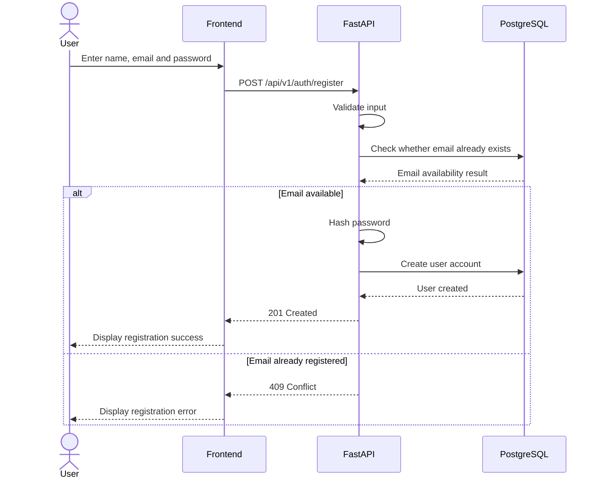

### Login Flow

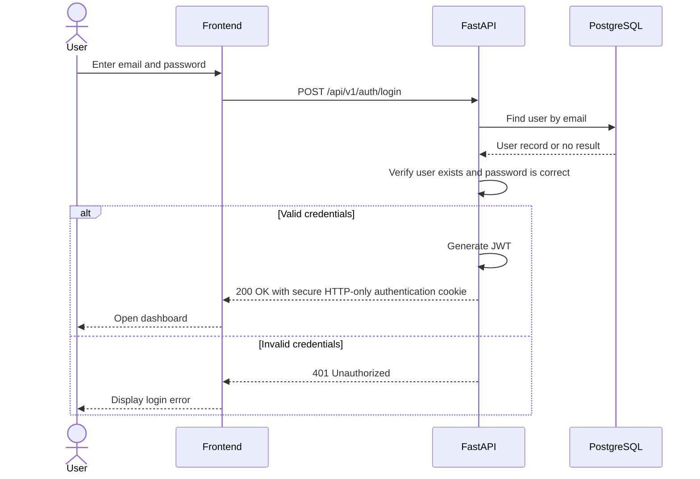

### Protected Request Flow

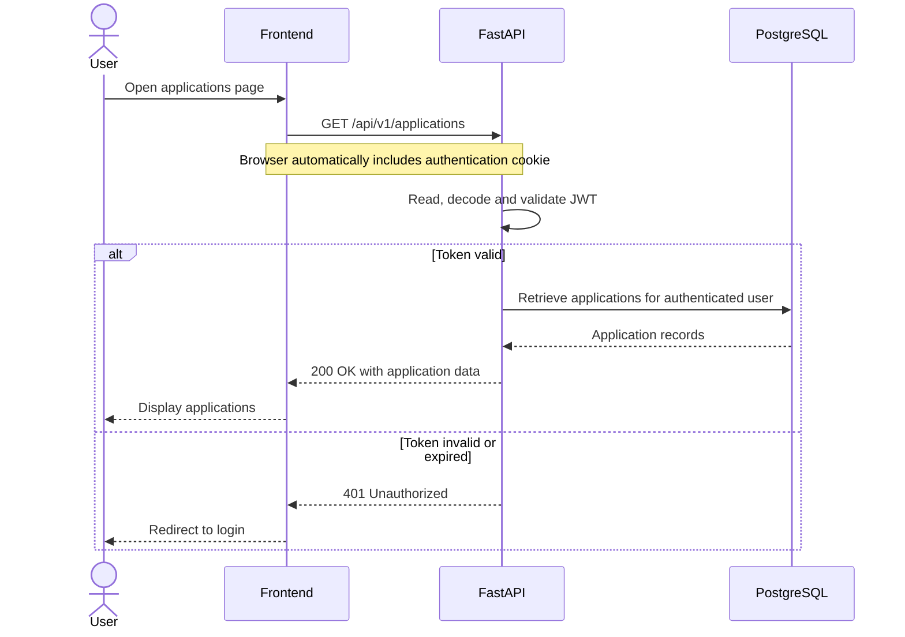

### Authorisation Rule

Authentication confirms the identity of the user. Authorisation determines which records the authenticated user is permitted to access or modify.

Every application query must be restricted using the user ID extracted from the validated JWT. The backend must not rely on a user ID supplied by the frontend.

For example:

```text
application_id = requested application ID
user_id = authenticated user ID extracted from the JWT
```

The backend should query using both values:

```text
Find the application where:

application.id = requested application ID
AND
application.user_id = authenticated user ID
```

This prevents one user from viewing, updating, or deleting another user's application by changing the application ID in the URL.

## Job Application Flow

### Create Application Flow

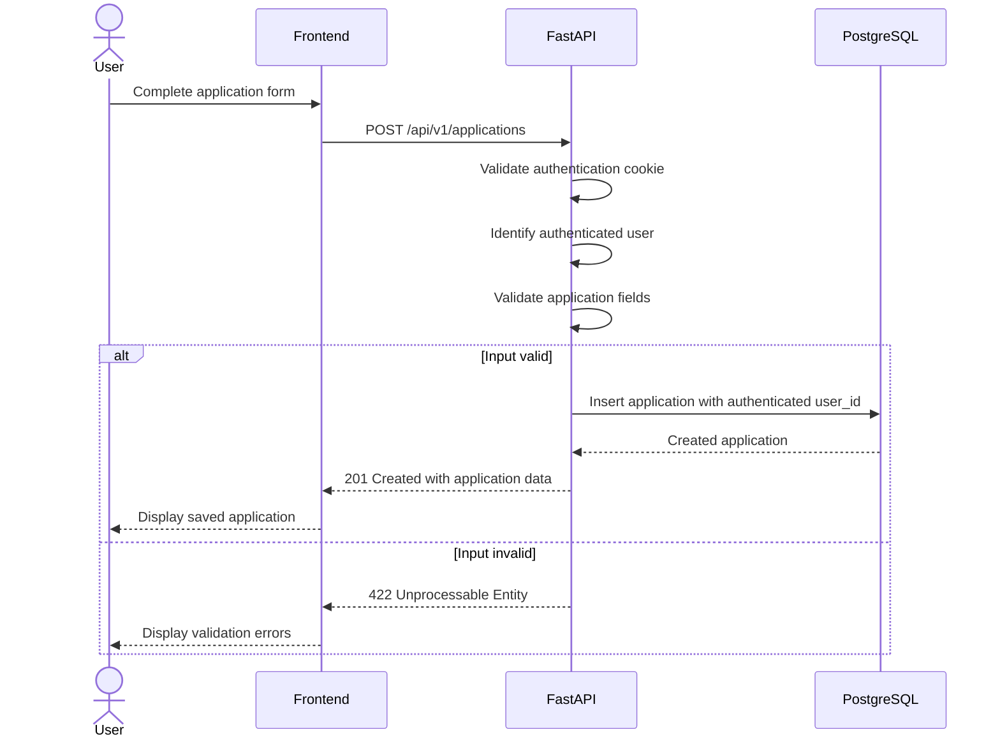

### View Applications Flow

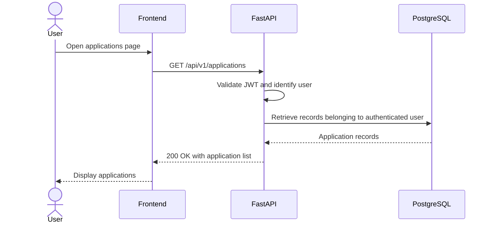

### View Single Application Flow

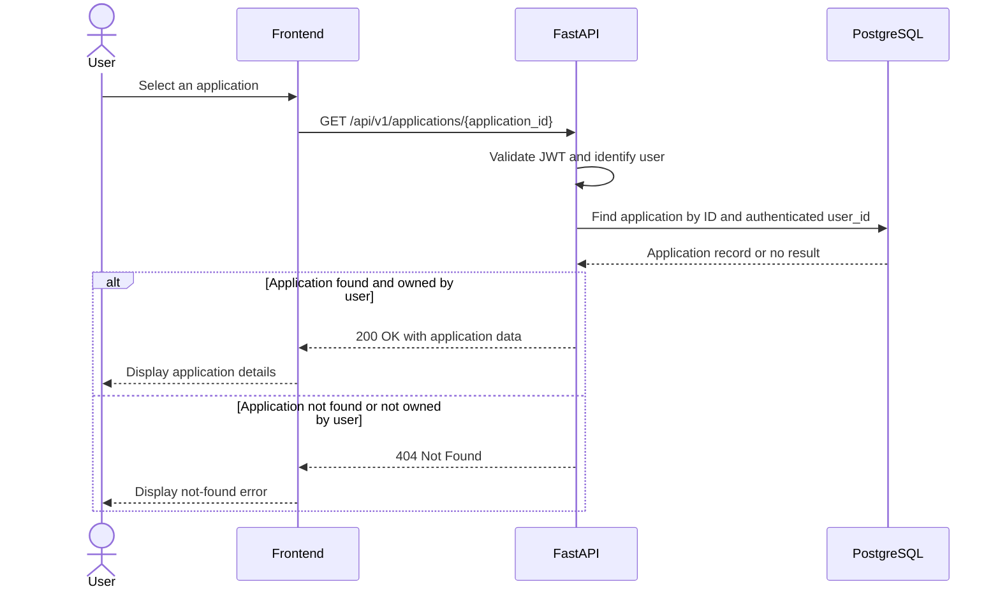

### Update Application Flow

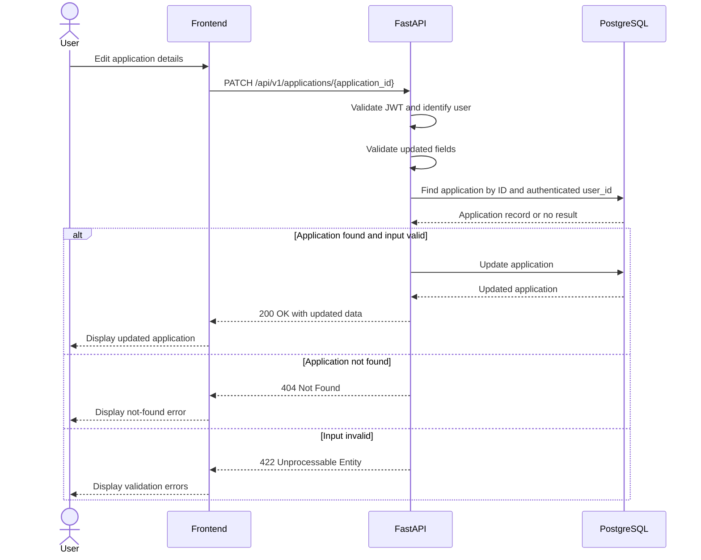

### Delete Application Flow

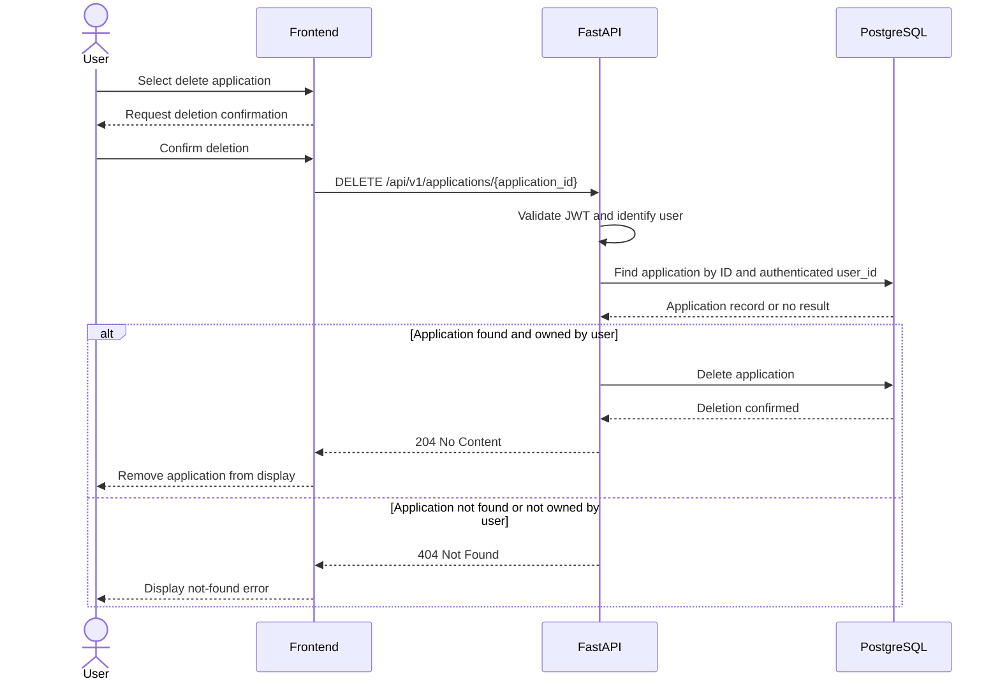

## Resume Upload Flow

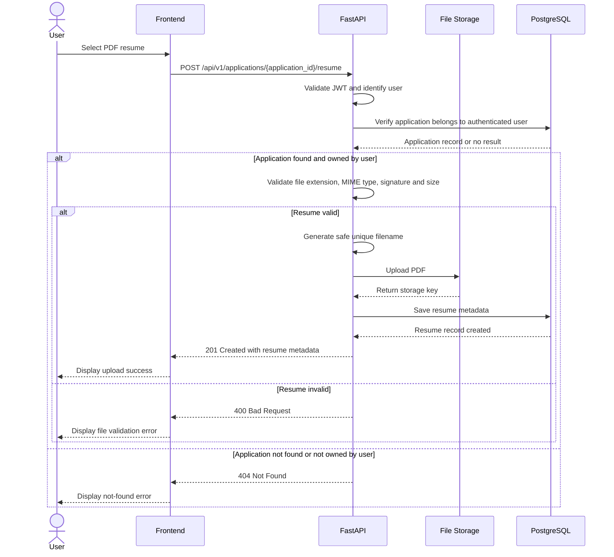

## Resume Analysis Flow

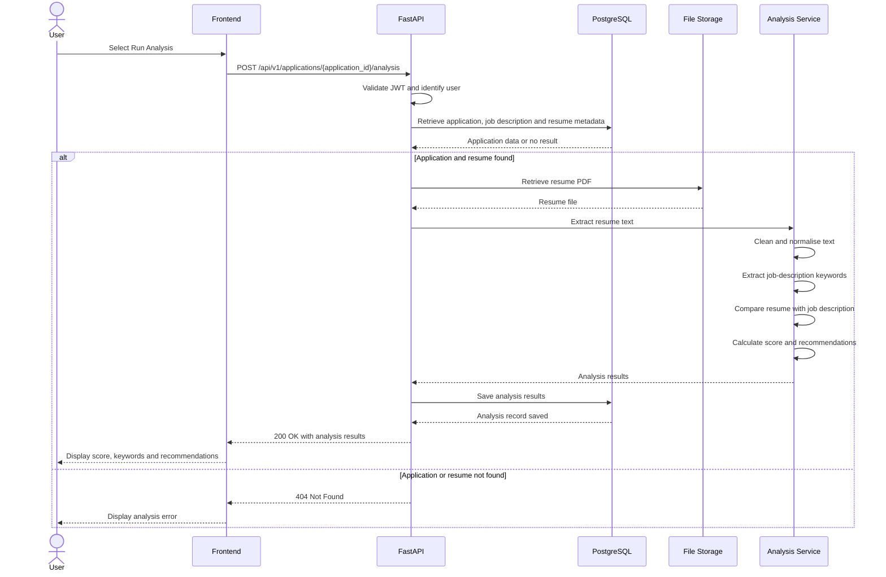

## Dashboard Flow

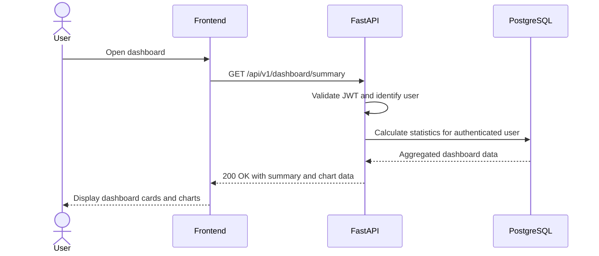

## Logout Flow

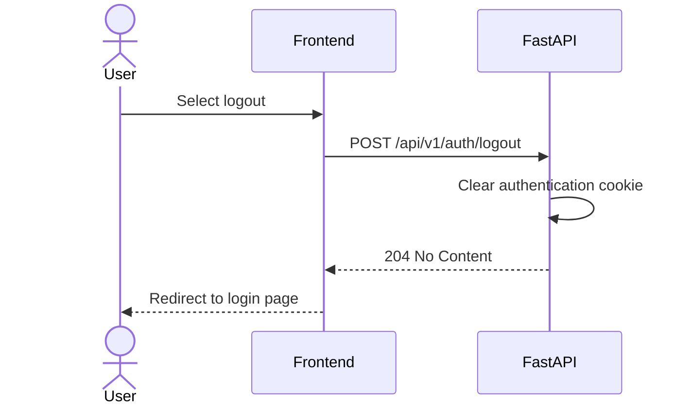
