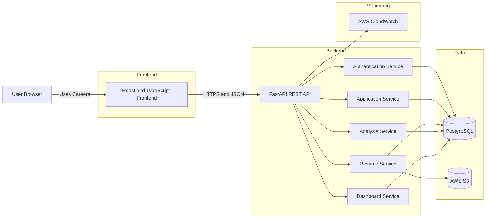

# Careera System Architecture

## Architecture Overview

Careera uses a client-server architecture with separate frontend, backend, database, and file-storage layers.

The React frontend communicates with the FastAPI backend through HTTPS requests. The FastAPI backend handles authentication, business logic, validation, database access, resume processing, and file-storage operations.

PostgreSQL stores structured application data. Resume PDF files are stored separately in AWS S3 in production.

## Component Responsibilities

### React Frontend

The frontend provides the user interface for registration, authentication, job-application management, resume uploads, analysis results, and dashboards.

### FastAPI Backend

The backend exposes REST API endpoints and handles all business logic, security checks, data validation, resume processing, and communication with external services.

### PostgreSQL

PostgreSQL stores users, job applications, resume metadata, analysis results, and other structured data.

### AWS S3

AWS S3 stores uploaded resume PDF files in the production environment.

### AWS CloudWatch

AWS CloudWatch receives application logs and infrastructure-monitoring information from the production backend.

## Communication Rules

* The frontend communicates only with the FastAPI backend.
* The frontend never connects directly to PostgreSQL or AWS S3.
* The backend validates every protected request.
* The backend verifies that a user owns a resource before returning or modifying it.
* Database credentials and AWS credentials are stored in environment variables.
* Public production communication must use HTTPS.
