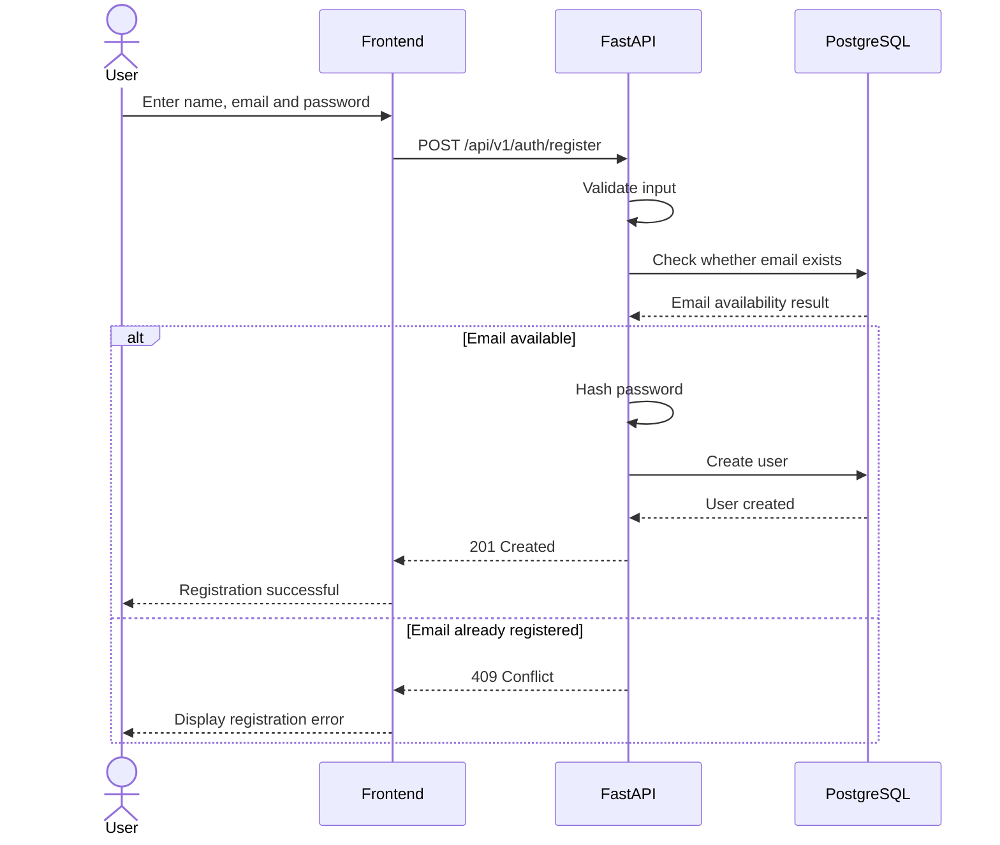
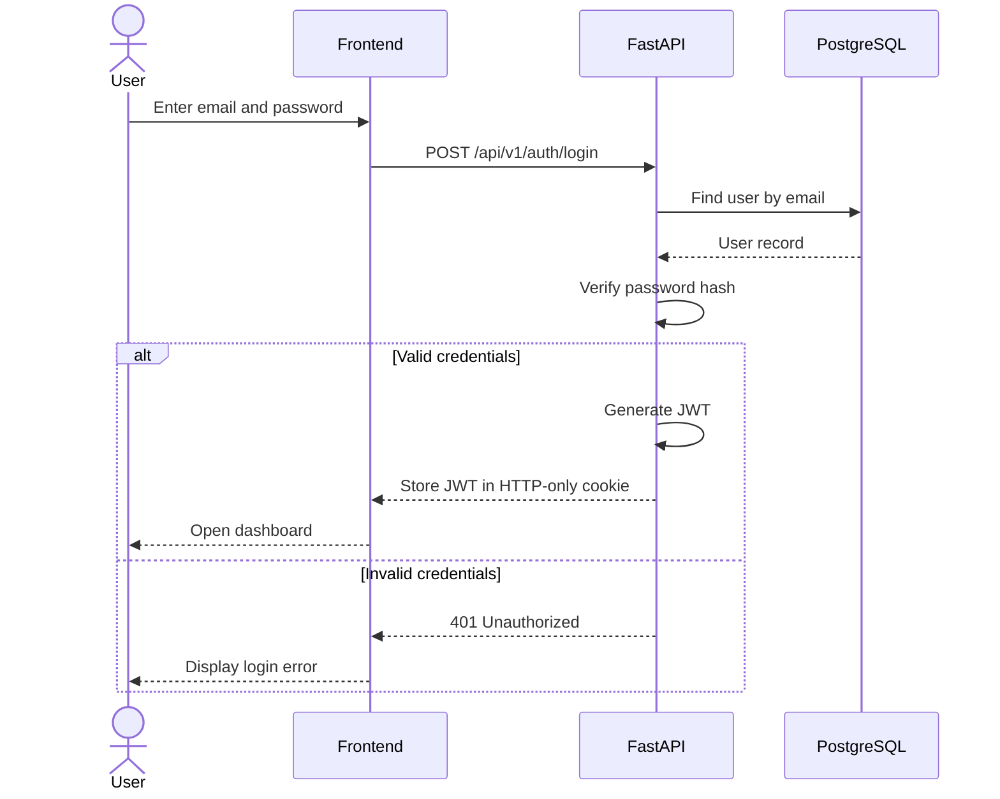
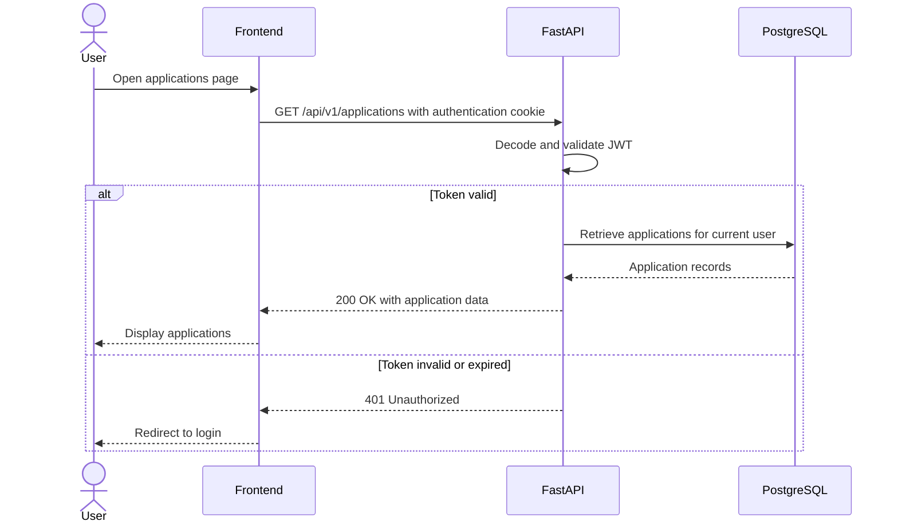

# Auth Flow

## Authentication Design

Careera uses email-and-password authentication. Passwords are hashed before being stored, and authenticated users receive a JSON Web Token (JWT).

In the final production design, the JWT will be stored in a secure HTTP-only cookie. Protected backend endpoints will validate the token and identify the current user before retrieving or modifying data.

### Registration Flow



### Login Flow



### Protected Request Flow



### Authorisation Rule

Authentication proves the identity of the user. Authorisation determines which records the authenticated user may access.

Every application query must include the authenticated user's ID. For example:

```text
application_id = requested application ID
user_id = authenticated user ID
```

This prevents one user from viewing or modifying another user's applications by changing the application ID in the URL.
